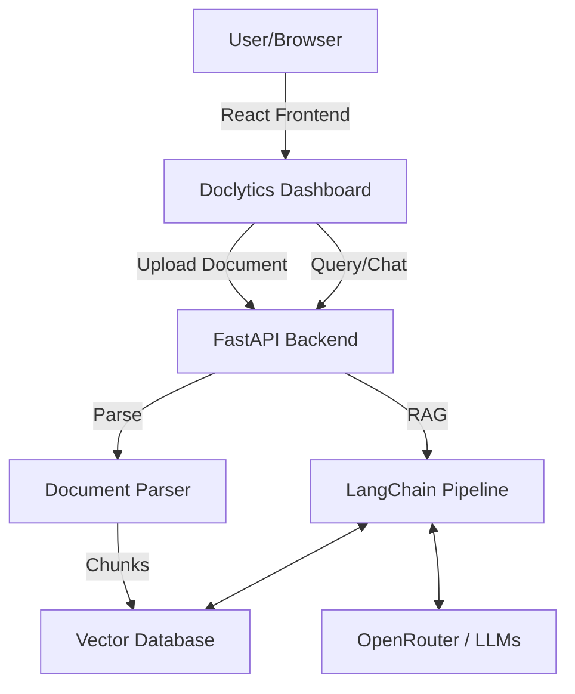

# Doclytics Beta

## 🚀 What is Doclytics?
Doclytics is an intelligent, full-stack document analysis and intelligence platform. It acts as an AI-powered Data Analyst that allows users to upload raw documents and datasets (CSV, Excel, PDF, TXT, DOCX) and instantly receive deep insights, automated KPI generation, and interactive visual charts. Instead of spending hours manually analyzing data, Doclytics automates the heavy lifting and provides a conversational interface to query the data naturally.

## 🎯 Problem Statement
In today's fast-paced environment, businesses and individuals generate massive amounts of unstructured and tabular data. The challenge lies in extracting meaningful insights from this data quickly without needing advanced data science or programming skills. Traditional tools require manual configuration, formula writing, or complex chart building. 

**Doclytics solves this by:**
- Eliminating the need for manual data parsing and chart generation.
- Providing an AI agent capable of answering complex analytical questions about uploaded datasets.
- Bridging the gap between raw data and actionable intelligence through a single, intuitive dashboard.

## 💡 Key Features
- **Multi-Format Support:** Upload CSV, Excel spreadsheets, PDFs, Word documents, and text files.
- **Automated Analytics:** Instantly generates KPIs, insights, and datasets for Bar, Line, Pie, and Scatter charts based on the uploaded data.
- **AI Data Analyst:** A dedicated AI chatbot that has full context of your uploaded documents, generated charts, and statistics, capable of answering queries and reasoning about your data.
- **General Chat AI:** A conversational assistant for general queries separate from document analysis.
- **Responsive Dashboard:** Fully responsive, modern UI built with React, Framer Motion, and Tailwind CSS, featuring a complete mobile layout and Dark/Light modes.
- **Production-Ready Architecture:** Robust FastAPI backend integrated with LangChain, FAISS for RAG, and multi-model fallback capability via OpenRouter.

## 🛠️ Technology Stack
- **Frontend:** React, Vite, Tailwind CSS, Framer Motion, Chart.js, React Router
- **Backend:** Python, FastAPI, LangChain, FAISS, PyMuPDF, Pandas
- **AI Integration:** OpenRouter
- **Storage:** Local storage manager (configured for ephemeral `/tmp` cloud compatibility)

## 📦 Deployment Ready
This codebase is optimized for a split-stack cloud deployment:
- **Frontend:** Pre-configured for **Vercel** with SPA routing (`vercel.json`).
- **Backend:** Pre-configured for **Render** with an included `render.yaml` blueprint and `Procfile`.

## 🏗️ Architecture

## 💻 Local Setup
1. Clone the repository
2. Navigate to the `backend` folder, install requirements (`pip install -r requirements.txt`), and run `uvicorn main:app --reload`
3. Navigate to the `frontend` folder, run `npm install`, and start the app with `npm run dev`
4. Access the dashboard at `http://localhost:5173`

## 📄 License
This project is open-source and available under the MIT License.
